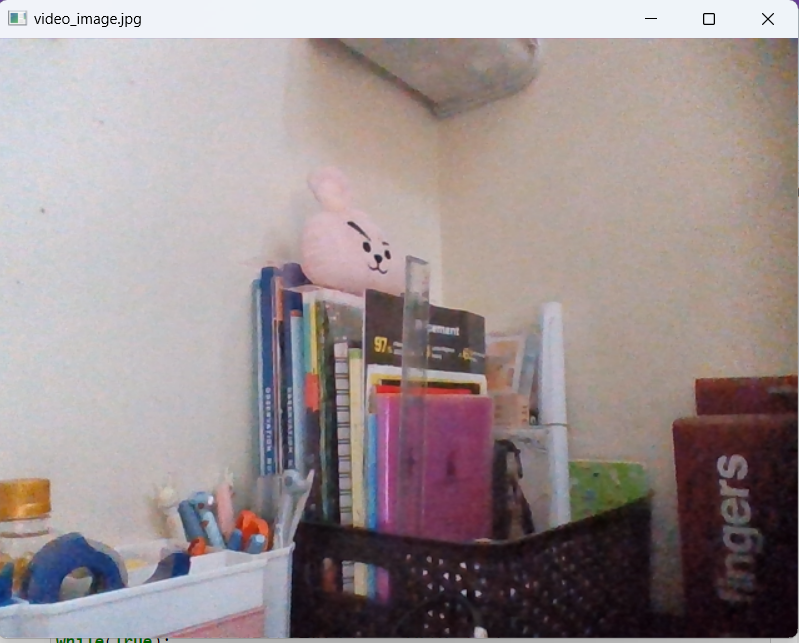
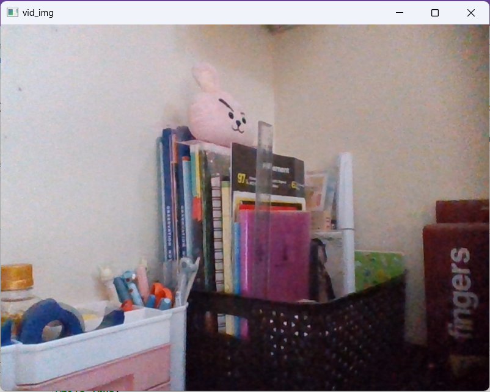
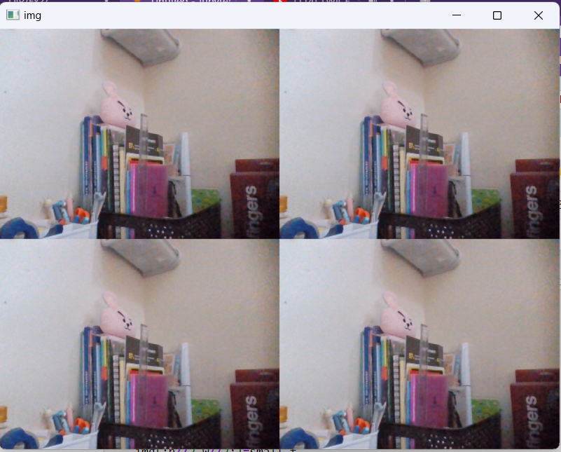
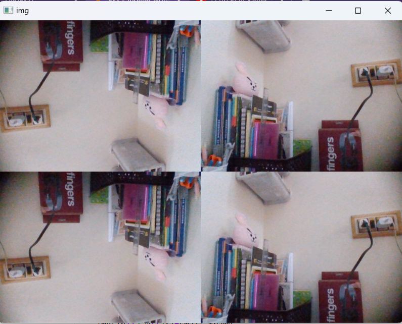

# Image-Acquisition-from-Web-Camera
## Aim:

To write a python program using OpenCV to capture the image from the web camera and do the following image manipulations.
i) Write the frame as JPG 
ii) Display the video 
iii) Display the video by resizing the window
iv) Rotate and display the video

## Software Used
Anaconda - Python 3.7
## Algorithm
### Step 1:
Import cv2 and capture the video using cv2.VideoCapture(0)
### Step 2:
Write the captured image using cv2.imwrite("video_image.jpg",frame)
### Step 3:
Resize the image using cv2.resize() to get a four-split screen.
### Step 4:
Rotate the image using cv2.rotate(smaller_frame,cv2.cv2.ROTATE_180)
### Step 5:
Display the image until the key to close the window is pressed.

## Program:
### Developed By: Meenakshi M
### Register No: 212221230057

## i) Write the frame as JPG file
```
obj = cv2.VideoCapture(0)
while(True):
    cap,frame = obj.read()
    cv2.imshow('video_image.jpg',frame)
    cv2.imwrite("out.jpg",frame)
    if cv2.waitKey(1) == ord('q'):
        break
obj.release()
cv2.destroyAllWindows()
```
## ii) Display the video
```
obj=cv2.VideoCapture(0)
while(True):
    cap,frame=obj.read()
    cv2.imshow('vid_img',frame)
    if cv2.waitKey(1)==ord('m'):
        break
obj.release()
cv2.destroyAllWindows()
```
## iii) Display the video by resizing the window
```
import numpy as np
cap=cv2.VideoCapture(0)
while True:
    ret,frame=cap.read()
    w=int(cap.get(3))
    h=int(cap.get(4))
    img=np.zeros(frame.shape,np.uint8)
    small_f=cv2.resize(frame,(0,0),fx=0.5,fy=0.5)
    img[:h//2,:w//2]=small_f
    img[h//2:,:w//2]=small_f
    img[:h//2,w//2:]=small_f
    img[h//2:,w//2:]=small_f
    cv2.imshow('img',img)
    if cv2.waitKey(1) == ord('q'):
        break
cap.release()
cv2.destroyAllWindows()
```
## iv) Rotate and display the video
```
import numpy as np
cap=cv2.VideoCapture(0)
while True:
    ret,frame=cap.read()
    w=int(cap.get(3))
    h=int(cap.get(4))
    img=np.zeros(frame.shape,np.uint8)
    small_frame=cv2.resize(frame,(0,0),fx=0.5,fy=0.5)
    img[:h//2,:w//2]=cv2.rotate(small_frame,cv2.ROTATE_180)
    img[h//2:,:w//2]=cv2.rotate(small_frame,cv2.ROTATE_180)
    img[:h//2,w//2:]=small_frame
    img[h//2:,w//2:]=small_frame
    cv2.imshow('img',img)
    if cv2.waitKey(1) == ord('q'):
        break
cap.release()
cv2.destroyAllWindows()
```
## Output

### i) Write the frame as JPG image

### ii) Display the video

### iii) Display the video by resizing the window

### iv) Rotate and display the video

## Result:
Thus the image is accessed from webcamera and displayed using openCV.
